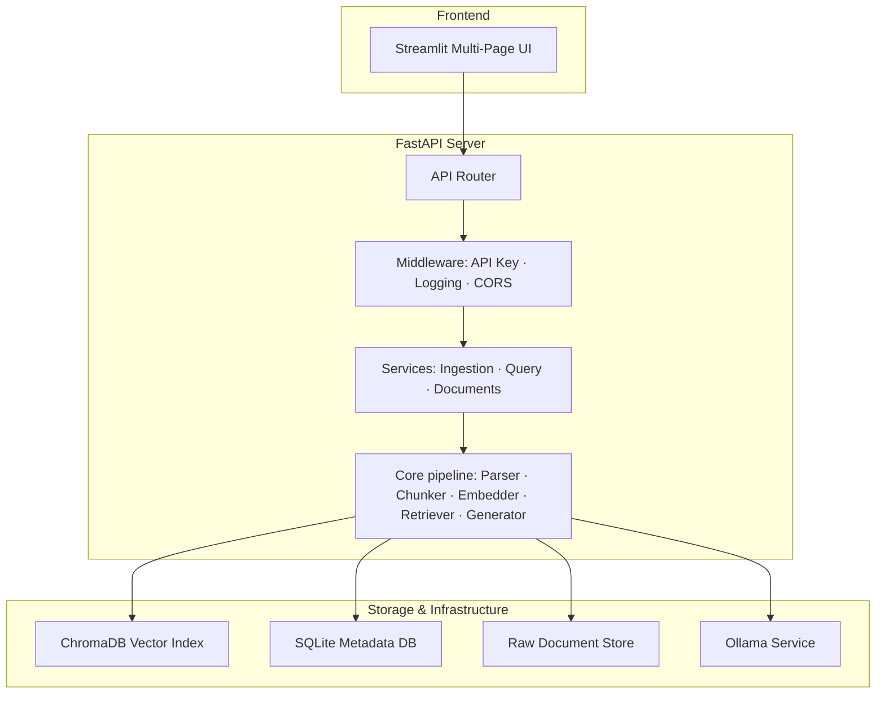

# 🧠 DocQuery AI — Production-Ready Local RAG Application

DocQuery AI is a local Retrieval-Augmented Generation (RAG) system that allows you to upload documents (PDF, TXT, DOCX, CSV, Excel, HTML) and ask questions against them using a local `gemma3:4b` model via Ollama. 

Built with a clean, decoupled, and production-grade architecture using FastAPI, SQLAlchemy + SQLite, ChromaDB, and Streamlit.

---

## ✨ Features

- **Multi-Format Ingestion**: Supports PDF, Word documents (`.docx`), Excel spreadsheets (`.xlsx`, `.xls`), CSV, HTML pages, and plain text (`.txt`).
- **Semantic Vector Search**: Uses the HuggingFace `sentence-transformers/all-MiniLM-L6-v2` model for high-speed local embedding generation.
- **100% Local LLM Generation**: Integrates with local Ollama (`gemma3:4b` or custom models) for answering queries.
- **Citations and Context Tracking**: Highlights source file names, chunk indices, and similarity scores directly in chat.
- **System Dashboard**: Visualizes file counts, chunk totals, and query latencies over time with Plotly interactive graphs.
- **Secure by Default**: Protects the API layer using a customizable token middleware verification (`X-API-Key`).
- **Developer Conveniences**: Fully automated database migrations, comprehensive test coverage (unit, integration, and E2E), and utility shortcuts in `Makefile`.

---

## 🏗️ Architecture



---

## ⚡ Prerequisites

Make sure you have python 3.11+ installed. Additionally, you will need to download and run the local Ollama daemon:

1. **Install Ollama**: Follow instructions on [ollama.ai](https://ollama.ai).
2. **Download Gemma3 model**:
   ```bash
   ollama pull gemma3:4b
   ```

---

## 🚀 Getting Started

### 1. Installation

Clone this repository, create a virtual environment, and install dependencies:

```bash
# Setup virtual environment
python3 -m venv .venv
source .venv/bin/activate

# Install all dependencies (development, testing, and frontend)
pip install -e ".[dev,frontend]"
```

### 2. Configure Environment Variables

Copy the `.env.example` template into a new `.env` file in the root directory:

```bash
cp .env.example .env
```
*(Optionally change the default `API_KEY` token or default settings inside `.env`)*

### 3. Run the FastAPI Backend

Start the backend server on `http://localhost:8000`:

```bash
.venv/bin/python main.py
```

### 4. Run the Streamlit Frontend

Open a new terminal tab/window and start the frontend interface on `http://localhost:8501`:

```bash
.venv/bin/streamlit run frontend/app.py
```

---

## 🔬 Testing & Quality Control

We run testing at three levels (Unit, Integration, and E2E API routes). Run the pytest suite using:

```bash
# Run all tests
.venv/bin/pytest tests/ -v
```

---

## 📁 Project Structure

```
docquery-ai/
├── app/
│   ├── api/          # Route controllers, middlewares, dependencies, and schemas
│   ├── core/         # RAG core stages (parse, chunk, embed, search, generate)
│   ├── db/           # Session setup & vector store configurations
│   ├── exceptions/   # Customized app exception classes
│   ├── models/       # Database ORM classes (SQLite metadata & queries history)
│   └── services/     # Ingest and Query business workflows orchestration
├── data/             # Persistent data volumes (uploads, SQLite, ChromaDB)
├── frontend/         # Streamlit UI layouts, pages, and components
└── tests/            # Test suite (unit, integration, and e2e)
```
