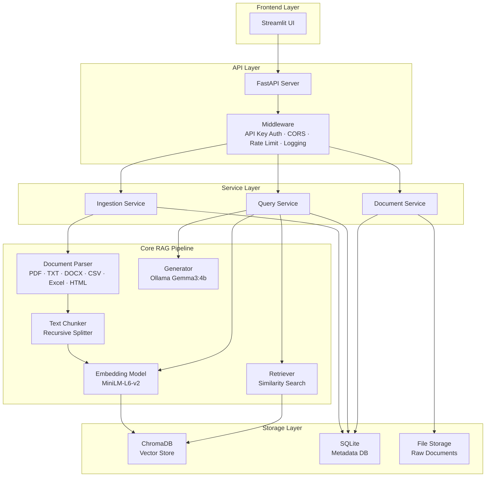
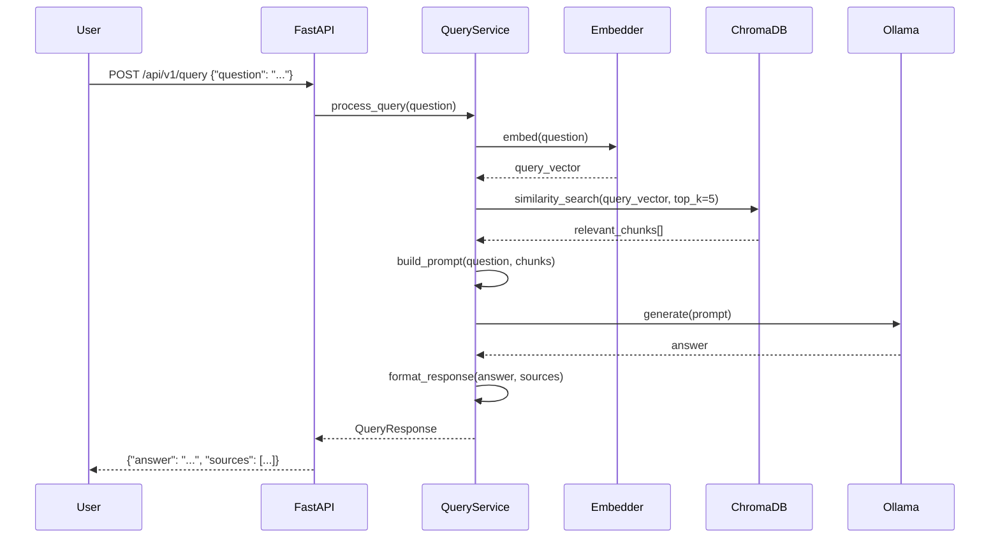

# 🧠 Production-Ready RAG Application — "DocQuery AI"

A Retrieval-Augmented Generation system that lets users upload documents (PDF, TXT, DOCX, CSV, Excel, HTML) and ask questions against them using a local Gemma3:4b model via Ollama. Built with a clean, production-grade architecture.

---

## 📌 Step 1: Project Selection & Rationale

### Why This Project?
| Reason | Details |
|--------|---------|
| **Practical** | Document Q&A is the #1 real-world RAG use case |
| **Resume-worthy** | Demonstrates end-to-end ML engineering skills |
| **Free stack** | 100% local — no API keys, no cloud bills |
| **Scalable** | Architecture supports swapping any component |
| **Production patterns** | Covers config management, logging, testing, Docker, CI/CD |

### What We're Building
A system where you:
1. **Upload** PDF/TXT/DOCX/CSV/Excel/HTML documents
2. **Ingest** → documents are chunked, embedded, and stored in a vector DB
3. **Query** → user asks a question, relevant chunks are retrieved, LLM generates an answer with citations
4. **Manage** → view uploaded docs, delete them, see query history

---

## 📌 Step 2: Tech Stack (100% Free & Local)

| Layer | Technology | Why This Choice |
|-------|-----------|-----------------|
| **LLM** | [Ollama](https://ollama.ai) — `gemma3:4b` | Free, local, already installed on your machine |
| **Embeddings** | `sentence-transformers/all-MiniLM-L6-v2` | Fast, small (80MB), great quality |
| **Vector Store** | ChromaDB | Simple, persistent, no server needed |
| **Backend API** | FastAPI | Async, auto-docs, production-proven |
| **Frontend** | Streamlit | Rapid UI, great for ML apps |
| **Doc Parsing** | PyMuPDF + python-docx + pandas + BeautifulSoup | PDF, DOCX, CSV, Excel, HTML extraction |
| **Chunking** | Custom recursive splitter | Full control, no heavy deps |
| **Auth** | API Key middleware | Simple, stateless request authentication |
| **Metadata DB** | SQLite (via SQLAlchemy) | Track documents, queries, analytics |
| **Config** | Pydantic Settings + YAML | Type-safe, environment-aware |
| **Logging** | Python `logging` + structlog | Structured, JSON-format logs |
| **Testing** | pytest + pytest-asyncio | Industry standard |
| **Containerization** | Docker + Docker Compose | Reproducible deployment |
| **CI/CD** | GitHub Actions | Automated testing & linting |

---

## 📌 Step 3: Production Architecture

### High-Level Architecture



### Request Flow (Query)



---

## 📌 Step 4: Folder Structure (with Explanations)

```
docquery-ai/
│
├── 📁 app/                          # Main application package
│   ├── __init__.py
│   │
│   ├── 📁 api/                      # API layer — HTTP interface
│   │   ├── __init__.py
│   │   ├── routes/                   # Route handlers (controllers)
│   │   │   ├── __init__.py
│   │   │   ├── documents.py          # POST /upload, GET /docs, DELETE /docs/{id}
│   │   │   ├── auth.py               # POST /auth/validate (API key validation)
│   │   │   ├── query.py              # POST /query
│   │   │   └── health.py             # GET /health, GET /ready
│   │   ├── dependencies.py           # FastAPI dependency injection (incl. API key dep)
│   │   ├── middleware.py             # CORS, logging, rate limiting, API key check
│   │   ├── auth.py                   # API key verification logic
│   │   └── schemas.py               # Pydantic request/response models
│   │
│   ├── 📁 core/                     # Core RAG pipeline components
│   │   ├── __init__.py
│   │   ├── parser.py                # Document parsing (PDF, TXT, DOCX, CSV, Excel, HTML)
│   │   ├── chunker.py               # Text chunking strategies
│   │   ├── embedder.py              # Embedding model wrapper
│   │   ├── retriever.py             # Vector similarity search
│   │   └── generator.py             # LLM interaction (Ollama)
│   │
│   ├── 📁 services/                 # Business logic layer
│   │   ├── __init__.py
│   │   ├── ingestion_service.py     # Orchestrates: parse → chunk → embed → store
│   │   ├── query_service.py         # Orchestrates: embed → retrieve → generate
│   │   └── document_service.py      # CRUD operations for documents
│   │
│   ├── 📁 models/                   # Database models (SQLAlchemy)
│   │   ├── __init__.py
│   │   ├── document.py              # Document metadata table
│   │   └── query_log.py             # Query history table
│   │
│   ├── 📁 db/                       # Database setup & sessions
│   │   ├── __init__.py
│   │   ├── database.py              # Engine, session factory
│   │   └── vector_store.py          # ChromaDB client wrapper
│   │
│   ├── 📁 config/                   # Configuration management
│   │   ├── __init__.py
│   │   ├── settings.py              # Pydantic Settings (env vars + defaults)
│   │   └── logging_config.py        # Structured logging setup
│   │
│   └── 📁 exceptions/               # Custom exception classes
│       ├── __init__.py
│       ├── auth.py                   # AuthenticationError, InvalidAPIKey
│       └── document.py              # UnsupportedFormat, ParseError
│
├── 📁 frontend/                     # Streamlit frontend
│   ├── app.py                       # Main Streamlit entry point
│   ├── pages/                       # Multi-page Streamlit app
│   │   ├── 1_📄_Upload.py           # Document upload page
│   │   ├── 2_💬_Chat.py             # Query/chat page
│   │   └── 3_📊_Dashboard.py        # Analytics dashboard
│   └── components/                  # Reusable UI components
│       ├── sidebar.py
│       └── chat_message.py
│
├── 📁 tests/                        # Test suite
│   ├── __init__.py
│   ├── conftest.py                  # Shared fixtures
│   ├── unit/                        # Unit tests (fast, isolated)
│   │   ├── test_chunker.py
│   │   ├── test_parser.py
│   │   └── test_embedder.py
│   ├── integration/                 # Integration tests (real components)
│   │   ├── test_ingestion.py
│   │   └── test_query.py
│   └── e2e/                         # End-to-end API tests
│       └── test_api.py
│
├── 📁 scripts/                      # Utility scripts
│   ├── seed_data.py                 # Load sample documents
│   └── reset_db.py                  # Reset databases
│
├── 📁 data/                         # Runtime data (gitignored)
│   ├── uploads/                     # Raw uploaded files
│   ├── chroma_db/                   # ChromaDB persistent storage
│   └── sqlite/                      # SQLite database files
│
├── 📁 docs/                         # Documentation
│   ├── architecture.md              # Architecture decisions
│   ├── api.md                       # API documentation
│   └── deployment.md                # Deployment guide
│
├── 📁 .github/                      # CI/CD
│   └── workflows/
│       ├── ci.yml                   # Lint + test on PR
│       └── docker.yml               # Build & push Docker image
│
├── .env.example                     # Environment variable template
├── .gitignore
├── Dockerfile                       # Multi-stage Docker build
├── docker-compose.yml               # Full stack orchestration
├── pyproject.toml                   # Project metadata + dependencies
├── Makefile                         # Developer convenience commands
├── README.md                        # Project overview
└── main.py                          # Application entry point
```

---

## 📌 Why Each Folder Exists

### `app/api/` — API Layer (Controller)
> **Purpose**: Translates HTTP requests into service calls and back. Includes API key authentication.
> **Why separate?** The API layer should know about HTTP (status codes, headers, validation) but NOT about business logic. If you switch from FastAPI to Flask, only this folder changes.

### `app/core/` — RAG Pipeline Components
> **Purpose**: Individual, reusable components of the RAG pipeline.
> **Why separate?** Each component (parser, chunker, embedder, retriever, generator) follows the **Single Responsibility Principle**. You can swap ChromaDB for Pinecone by only changing `retriever.py`. You can swap Gemma3 for GPT-4 by only changing `generator.py`.

### `app/services/` — Business Logic (Orchestration)
> **Purpose**: Orchestrates core components into workflows.
> **Why separate?** Services contain the "how things work together" logic. The ingestion service knows: parse → chunk → embed → store. The query service knows: embed → retrieve → generate. This is the layer you unit-test most heavily.

### `app/models/` — Database Models
> **Purpose**: SQLAlchemy ORM models defining database tables.
> **Why separate?** Keeps data schema definitions in one place. Changes to the database structure are isolated here.

### `app/db/` — Database Infrastructure
> **Purpose**: Connection setup, session management, vector store client.
> **Why separate?** Infrastructure code (how to connect) is separate from schema (what to store) and business logic (what to do with data).

### `app/config/` — Configuration
> **Purpose**: Centralized, type-safe configuration using Pydantic Settings.
> **Why separate?** One source of truth for all settings. Supports `.env` files, environment variables, and defaults. Different configs for dev/test/prod without code changes.

### `frontend/` — Streamlit UI
> **Purpose**: User interface, completely decoupled from backend.
> **Why separate?** The frontend communicates with the backend via HTTP API. You could replace Streamlit with React without touching backend code.

### `tests/` — Test Suite (3-tier)
> **Purpose**: Organized testing at three levels:
> - **Unit**: Test individual functions in isolation (fast, no external deps)
> - **Integration**: Test components working together (uses real ChromaDB, etc.)
> - **E2E**: Test full API endpoints (like a real client would)
>
> **Why this structure?** The testing pyramid: many fast unit tests, fewer integration tests, few slow E2E tests.

### `data/` — Runtime Data
> **Purpose**: Stores uploaded files, ChromaDB data, SQLite databases.
> **Why separate?** Gitignored. Keeps runtime data out of version control. Docker volumes mount here.

### `app/exceptions/` — Custom Exceptions
> **Purpose**: Centralized error types (auth errors, parse errors, unsupported formats).
> **Why separate?** Consistent error handling across the app. API layer catches these and maps to HTTP status codes.

### `scripts/` — Developer Utilities
> **Purpose**: One-off scripts for seeding data, resetting DBs, etc.
> **Why separate?** Keeps utility code out of the main application.

---

## 📌 Step 5: Implementation Order

We'll build this in phases, each producing a working, testable increment:

### Phase 1: Foundation (Config + Project Setup)
- [ ] Initialize project with `pyproject.toml`
- [ ] Set up configuration management (`app/config/`)
- [ ] Set up structured logging
- [ ] Create the FastAPI app skeleton with health check

### Phase 2: Core RAG Pipeline
- [ ] Document parser (PDF, TXT, DOCX, CSV, Excel, HTML)
- [ ] Text chunker (recursive character splitter)
- [ ] Embedding model wrapper
- [ ] ChromaDB vector store integration
- [ ] Retriever (similarity search)
- [ ] Generator (Ollama Gemma3:4b integration)

### Phase 3: Services + API
- [ ] Database models + setup (SQLAlchemy + SQLite)
- [ ] Ingestion service (upload → parse → chunk → embed → store)
- [ ] Query service (question → embed → retrieve → generate)
- [ ] Document service (list, get, delete)
- [ ] API routes (documents, query, health)

### Phase 4: Frontend
- [ ] Streamlit app with multi-page layout
- [ ] Upload page
- [ ] Chat/query page
- [ ] Dashboard page

### Phase 5: Production Hardening
- [ ] Custom exception classes
- [ ] Rate limiting + API Key middleware
- [ ] Unit tests + integration tests
- [ ] Docker + Docker Compose
- [ ] GitHub Actions CI/CD
- [ ] Documentation

---

## 📌 Prerequisites

Before we start coding, you'll need:

| Tool | Status | Purpose |
|------|--------|----------|
| Python 3.11+ | ✅ Verify needed | Runtime |
| Ollama | ✅ Installed | Local LLM server |
| gemma3:4b | ✅ Installed | The LLM we'll use |

---

## ✅ Decisions Finalized

| Decision | Choice |
|----------|--------|
| **LLM Model** | `gemma3:4b` via Ollama (already installed) |
| **Document Types** | PDF, TXT, DOCX, CSV, Excel, HTML |
| **Authentication** | Simple API key auth via middleware |
| **Vector Store** | ChromaDB |
| **Frontend** | Streamlit |
| **Scope** | All 5 phases — full production build |

> [!TIP]
> All open questions are resolved. Ready to start building Phase 1!
